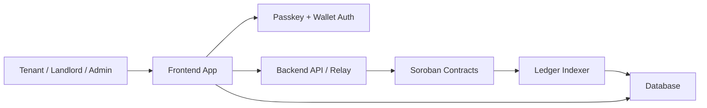

# StellarPad

**StellarPad** is the open-source ecosystem building tokenized property marketplaces and real-world asset finance infrastructure on Stellar.

We deliver:
- tenant / landlord marketplace UX
- secure on-chain escrow
- reputation and dispute workflows
- passwordless wallet/passkey authentication
- lightweight Soroban contract integration

---

## Mission

StellarPad makes property and rental finance frictionless by combining:
- Stellar’s low-cost, fast settlement
- Soroban smart-contract escrow and reputation controls
- modern web UX with passkeys and wallet interoperability
- composable frontend/backend architecture

We believe property finance should be digital, transparent, and built on resilient blockchain infrastructure.

---

## What We Build

StellarPad is focused on two core repositories:

- `StellarPad-Frontend`
  - React + Next.js marketplace UI
  - tenant and landlord dashboards
  - listing discovery, checkout, escrow initiation
  - passkey + wallet authentication
- `StellarPad-Backend`
  - API and transaction relay service
  - Stellar Horizon / Soroban integration
  - escrow event indexing and contract state sync
  - reputation, disputes, and settlement workflows

---

## Architecture

Key flow:
1. User signs with passkey or wallet
2. Frontend assembles signed XDR
3. Backend relay submits to Stellar/Soroban
4. Indexer persists on-chain events
5. Frontend updates UI from backend state

---

## Core Principles

- **User-first**
  - clear checkout flow
  - tenant and landlord roles
- **Secure by default**
  - private keys are never stored in the app
  - signed transaction relay only
- **Composable**
  - frontend and backend evolve independently
- **Low-cost settlement**
  - Stellar transaction efficiency
- **Transparent**
  - audit-ready escrow and dispute records

---

## Repositories

### `StellarPad-Frontend`
- Built with `Next.js`, `React`, and Tailwind
- Marketplace listings, property detail pages
- Checkout, wallet integration, passkey auth
- UI for escrows, disputes, dashboards

### `StellarPad-Backend`
- Built with `Node.js` and `TypeScript`
- Transaction relay and Stellar Horizon integration
- Escrow lifecycle orchestration
- Event indexing for real-time state sync

---

## Features

- Marketplace listings and search
- On-chain escrow creation and release
- Tenant / landlord dashboards
- Reputation tracking and dispute workflows
- Passkey + wallet authentication
- Signed transaction relay and contract submission
- Indexing of on-chain events

---

## Getting Started

### For developers
1. Clone the repo you want to work on
2. Install dependencies
   - `npm install`
3. Configure environment variables for Stellar testnet
4. Run locally
   - `npm run dev` for frontend
   - backend start command in `StellarPad-Backend`

### For contributors
- Open issues or PRs in the appropriate repo
- Keep changes focused and documented
- Add tests for new flows
- Review security around escrow and wallets

---

## Organization Scope

This org currently includes:
- `StellarPad-Frontend`
- `StellarPad-Backend`

This README is intentionally high-level: use each repository’s own README for project-specific setup, architecture, and implementation details.

---

## License

See each repository’s `LICENSE` file for license details.

---

## Note

This organization README is designed for the StellarPad org itself. It is not a repo-specific implementation guide, but a summary of the frontend/backend ecosystem that defines StellarPad.Key flow:
1. User signs with passkey or wallet
2. Frontend assembles signed XDR
3. Backend relay submits to Stellar/Soroban
4. Indexer persists on-chain events
5. Frontend updates UI from backend state

---

## Core Principles

- **User-first**
  - clear checkout flow
  - tenant and landlord roles
- **Secure by default**
  - private keys are never stored in the app
  - signed transaction relay only
- **Composable**
  - frontend and backend evolve independently
- **Low-cost settlement**
  - Stellar transaction efficiency
- **Transparent**
  - audit-ready escrow and dispute records

---

## Repositories

### `StellarPad-Frontend`
- Built with `Next.js`, `React`, and Tailwind
- Marketplace listings, property detail pages
- Checkout, wallet integration, passkey auth
- UI for escrows, disputes, dashboards

### `StellarPad-Backend`
- Built with `Node.js` and `TypeScript`
- Transaction relay and Stellar Horizon integration
- Escrow lifecycle orchestration
- Event indexing for real-time state sync

---

## Features

- Marketplace listings and search
- On-chain escrow creation and release
- Tenant / landlord dashboards
- Reputation tracking and dispute workflows
- Passkey + wallet authentication
- Signed transaction relay and contract submission
- Indexing of on-chain events

---

## Getting Started

### For developers
1. Clone the repo you want to work on
2. Install dependencies
   - `npm install`
3. Configure environment variables for Stellar testnet
4. Run locally
   - `npm run dev` for frontend
   - backend start command in `StellarPad-Backend`

### For contributors
- Open issues or PRs in the appropriate repo
- Keep changes focused and documented
- Add tests for new flows
- Review security around escrow and wallets

---

## Organization Scope

This org currently includes:
- `StellarPad-Frontend`
- `StellarPad-Backend`

This README is intentionally high-level: use each repository’s own README for project-specific setup, architecture, and implementation details.

---

## License

See each repository’s `LICENSE` file for license details.

